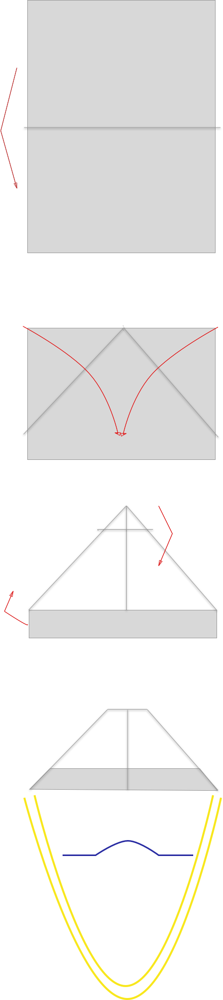

# HMask
## The face mask project for HEPA filters

Hepa filters offers 99.97% filtering efficiency at 0.3 micron for particulate matter, hence can be used to filter out viruses. The aim of current project is to create a design for face mask using hepa filter.

Target is to build a mask without using stitching which will reduce the build time. The design is inspired from origami airplane design. Since hepa filters are used in car cabin filters, air purifiers and vacuum cleaners, it may be possible to mass produce hepa filters.  Combined with short build time for Hmask , we will be able to produce face masks in case we run short of N95 masks. Detailed testing need to be carried out to qualify Hmask as an N95 equivalent mask.

## How to create

[View Here](https://youtu.be/WQjonYv3WdI)

    

### Origami

## DIY Face Shield

Face shields are used by healthcare givers in hospital environment to protect against sputter. Since #COVID19 spread through droplets produced by sneeze, cough or spit , service personal like police or delivery men and even general public could also use them. Used along with facemask and cap it gives protection for the facial area. Use PE, PET, (polyethylene terephthalate), PEG material to make the shield. You could use the overhead projector slide for DIY. This is based on feedback I got from a textile material expert. In this video a PE material like transparent thick plastic is used. One can reuse face shield after killing the germs with detergent. This video is meant for sharing the idea. If you make one consult your local health department before using it.

### How to create

[View Here](https://youtu.be/EocG8p3JVho)

    

[More Here](Fshield.pdf)

Created By: [Barker Bhaskaran](https://github.com/barkerbhaskaran)

## PIC (Portable intubation chamber)

[More Here](PIC.pdf)

